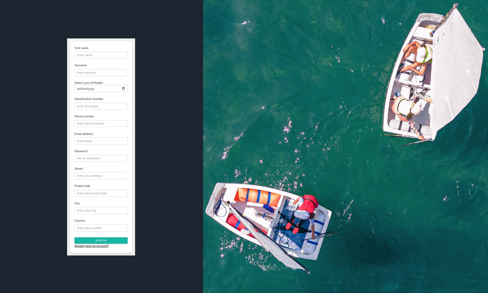
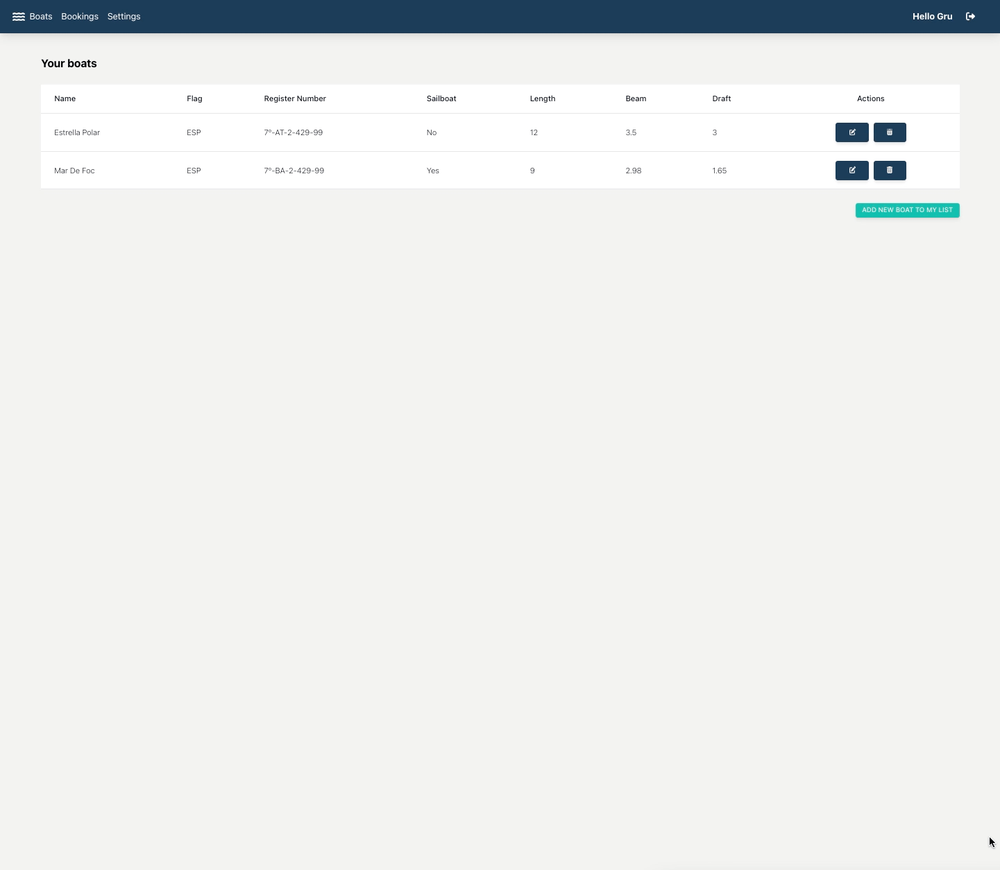
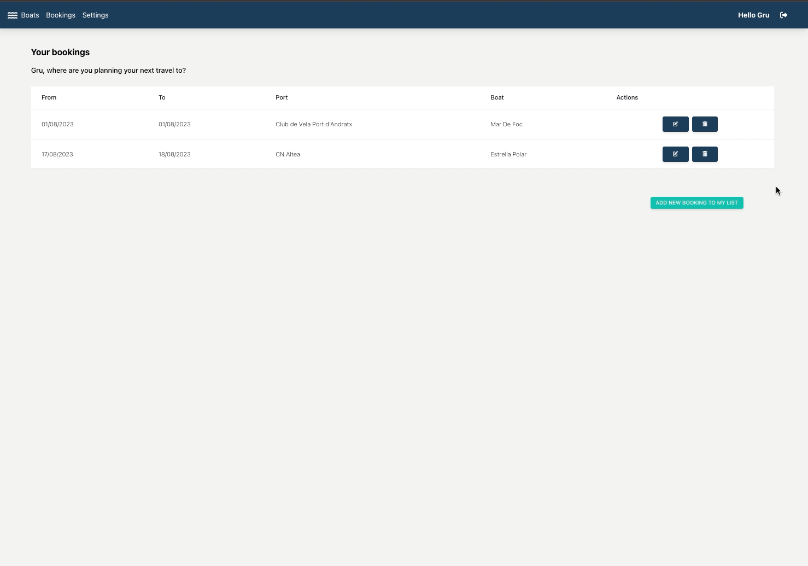
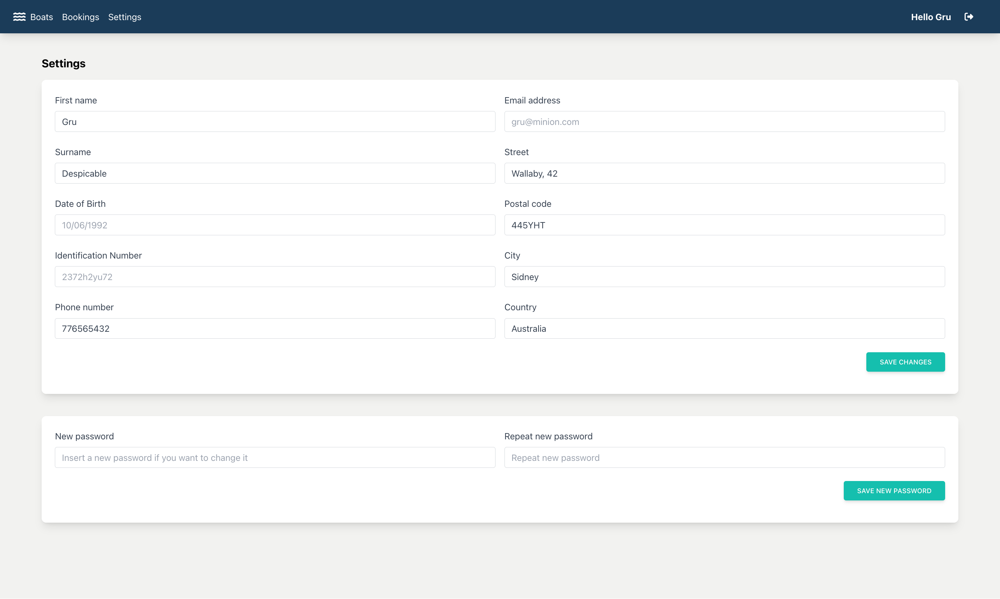

# Boating-app

The main idea of this is to mix technology with a field/subject I am really passionate about: the sea.  While thinking about this, I asked myself, if in Internet you can book in different sites the accomodation in-land, what about an app to book stays in port when sailing? And that is how Boating-app was born.
The user will view the available ports, check the weather on each site, add and manage boats and bookings.

## Development environment

- `dev`/`start` - start dev server and open browser
- `build` - build for production
- `preview` - locally preview production build
- `test` - launch test runner

> This project requires the corresponding API project found [here](https://github.com/crismarqizq/boating-app-backend)

## Functional Description

- [X] Register User
- [X] User Login
- [X] CRUD of user's boats
- [X] CRUD of port bookings
- [X] User settings
- [X] View main port info
- [X] Check the weather on each port

## App showcase

### Login and homepage

### Register form

### Boats manager

### Bookings manager

### User settings

## Technical Description

### 🔩 Technologies

- TypeScript
- React
- React Router
- Redux Toolkit
- Axios
- JWT
- Tailwind

### 📚 Redux, store and slices

This application is structured using the following state slices: 

- `auth`
- `boats`
- `bookings`
- `ports`

## References 

- [Create React App](https://github.com/facebook/create-react-app/tree/main/packages/cra-template)
- [Vite](https://github.com/vitejs/vite/tree/main/packages/create-vite/template-react)
- [Vitest](https://github.com/vitest-dev/vitest/tree/main/examples/react-testing-lib)
